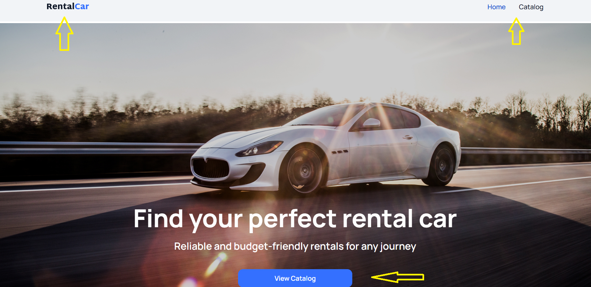
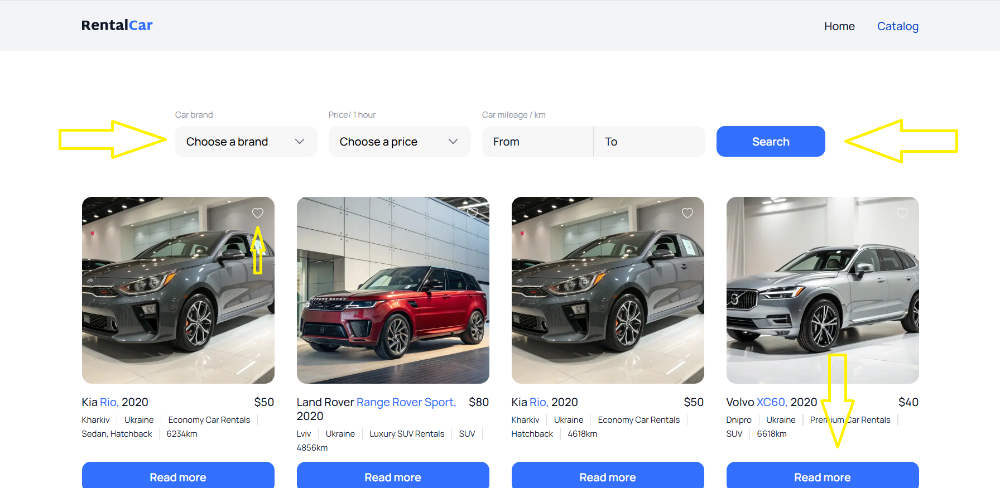
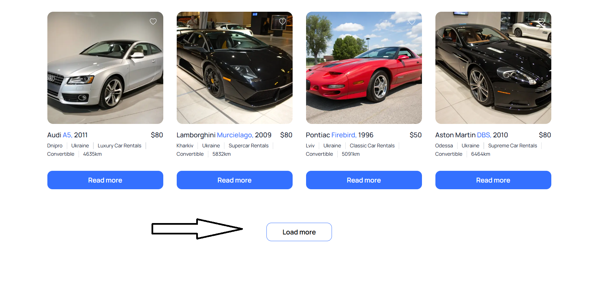
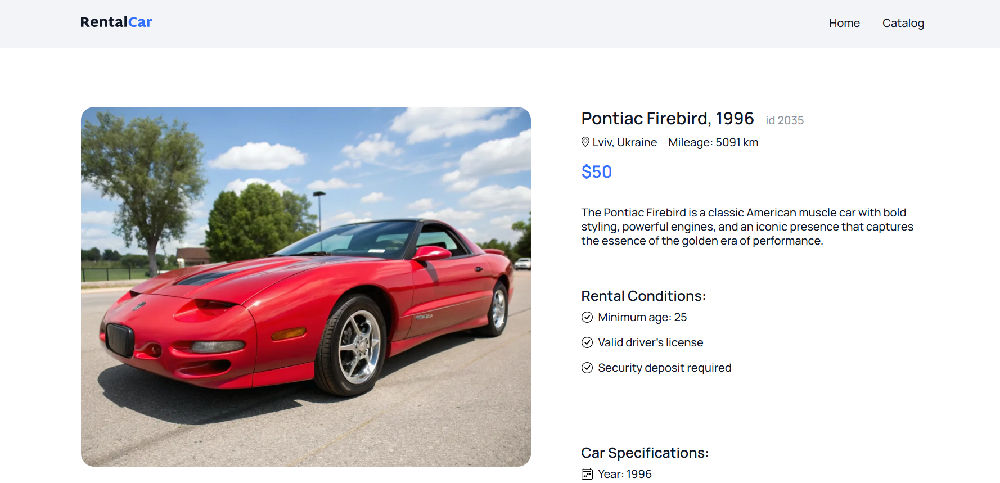
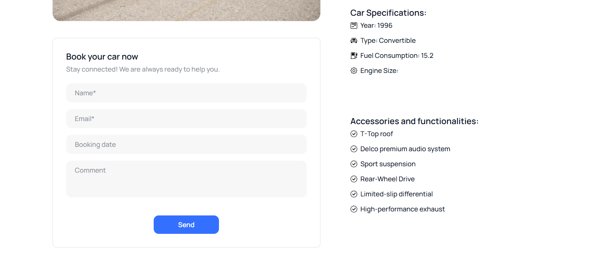

# Rental Car

The Pasha app will help you find and rent a suitable car. You can use various
search filters, view vehicle details, and then submit a request.

## Key Features

### Home page

This is our website's welcome page. Here you can see the main banner and a
button to go to the catalog. All pages also have a header. It contains a logo,
which, when clicked, will take you to the main page. Also on the right, you can
see captions, which indicate which page you're currently on. Clicking on them
will also take you to that page.



### Page catalog

Once you go to the catalog page, you'll see a list of cars currently available
for rent. Here, you can also add features you're interested in to filter the
list. To update the list based on your filters, click the button. The search
form isn't cleared after you've searched, so you can change any previously set
filters. The list will display the cars found. Here, you can mark the ones you
like. You'll also see a short description of the cars. Clicking the button next
to the selected car will take you to its detailed description page.



At the very bottom of the list is a button for loading the next batch of cars.
It will be grayed out when there are no more cars available.



### Car Details Page

On this page, you can view detailed information about the selected vehicle and
see a larger image.



There's also a rental application form on this page. You can enter your
information and submit your application. You'll then see a confirmation pop-up.



## Tech stack


## How to use

1. Clone this repository
   ```
   git clone (HTTPS or SSH key)
   ```
2. Run the project build command
   ```
   npm run build
   ```
3. Launch the project
   ```
   npm run start
   ```
